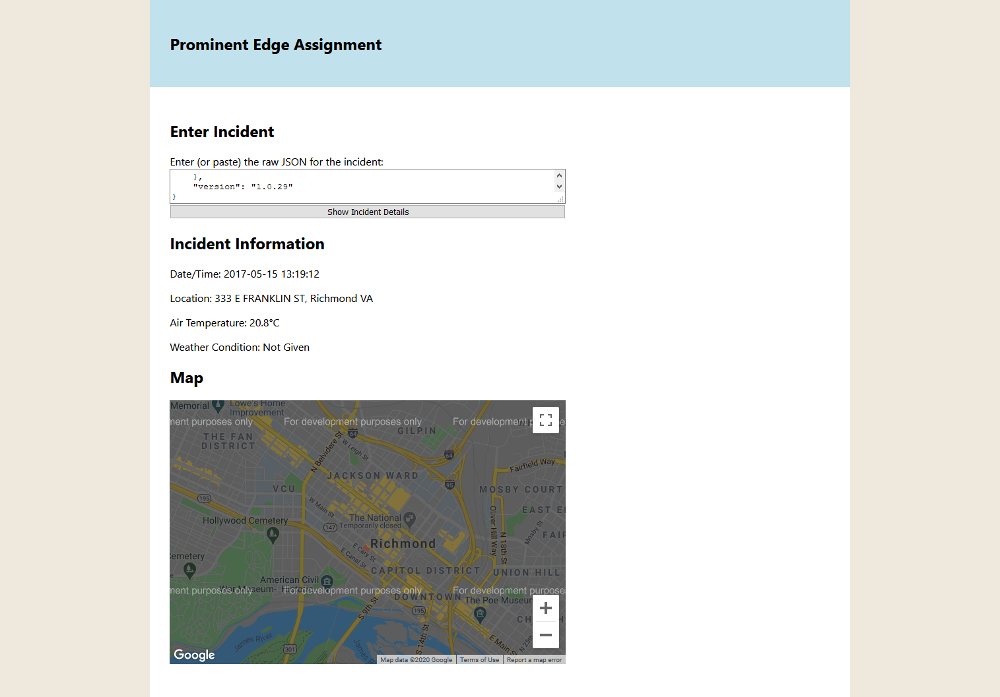

# prominent-edge-assignment

Implemented as a simple React app.

## Clone and setup the app

```
git clone https://github.com/SharkDemon/prominent-edge-assignment.git
cd prominent-edge-assignment
cd frontend
```
Provide a Meteostat API key in your .env file.  The name of the key that needs to be provided is REACT_APP_METEOSTAT_API_KEY.

Provide a Google Map Javascript API key in your .env file.  The name of the key that needs to be provided is REACT_APP_GOOGLE_MAPS_API_KEY.

## Run the app

Start up a local server by running command:
```
npm start
```
Then navigate to http://localhost:3000

## Improvements

- Add authentication
- Maybe some buttons to load the sample incident JSON files
- Add ability to pull incident JSON files from another source (db, api, etc), with search capabilities
- Add ability to customize which details of the incident display under information
- Add ability to customize initial zoom level
- Since incidents aren't just a single "time" but rather represent a series of discrete events, build out a full timeline (event opens, units dispatched, units arrive, event closes)

## Time Spent

- 7.5 hours (2pm - 8pm, 8:30pm - 10pm)

## Screenshot

